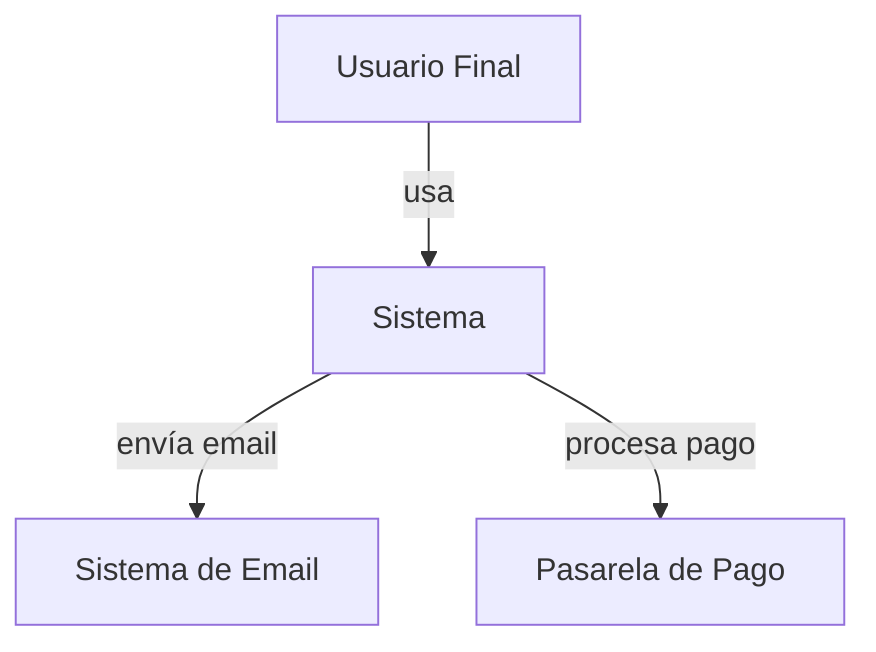
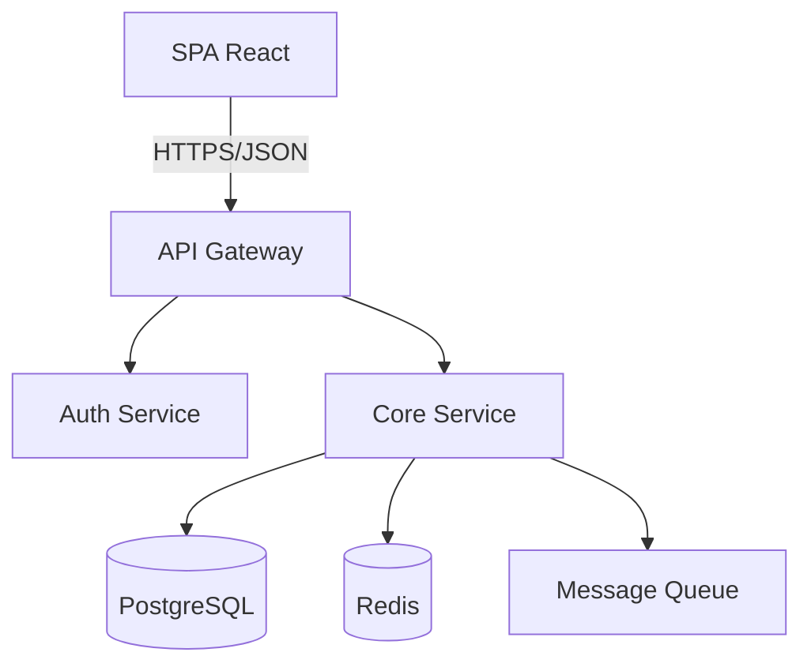

# Diseño de Sistemas — Guía de Referencia

## Proceso de Diseño Arquitectónico

Sigue este proceso para diseñar sistemas desde cero o diseñar componentes nuevos.

---

## Fase 1: Comprensión del Problema

### Requerimientos Funcionales
- ¿Qué hace el sistema? (casos de uso principales)
- ¿Quiénes son los usuarios/actores?
- ¿Cuáles son los flujos críticos del negocio?

### Requerimientos No Funcionales (Quality Attributes)
Siempre pregunta y cuantifica:
- **Escala**: ¿Cuántos usuarios concurrentes? ¿Transacciones por segundo?
- **Latencia**: ¿Qué latencia es aceptable? (p99, no solo promedio)
- **Disponibilidad**: ¿Cuántos nines? (99.9% = 8.7h downtime/año)
- **Consistencia**: ¿Strong consistency o eventual consistency?
- **Durabilidad**: ¿Qué pasa si se pierde un dato?
- **Geo-distribución**: ¿Opera en múltiples regiones?

### Restricciones
- Presupuesto de infraestructura
- Tamaño y skills del equipo
- Stack tecnológico existente
- Regulaciones (GDPR, SOC2, HIPAA, etc.)
- Tiempo al mercado

---

## Fase 2: Diseño de Alto Nivel

### Modelo C4
Usa el modelo C4 para estructurar el diseño en capas:

**Nivel 1 — Contexto del Sistema:**


**Nivel 2 — Contenedores:**


**Nivel 3 — Componentes** (dentro de un contenedor)

**Nivel 4 — Código** (diagramas de clases, si es necesario)

---

## Fase 3: Decisiones de Diseño Clave

### Monolito vs Microservicios

**Empezar con Monolito cuando:**
- Equipo pequeño (< 8 personas)
- Dominio aún no está bien entendido
- MVP o producto temprano
- Velocidad de desarrollo es prioritaria

**Migrar a Microservicios cuando:**
- Equipos independientes necesitan deployar sin coordinación
- Partes del sistema tienen requerimientos de escala muy diferentes
- El dominio está bien delimitado (bounded contexts claros)
- Hay madurez en CI/CD y observabilidad

### Comunicación entre Servicios

| Patrón | Cuándo usarlo |
|--------|--------------|
| REST/HTTP síncrono | Cuando se necesita respuesta inmediata y acoplamiento temporal es aceptable |
| gRPC | Comunicación interna de alta performance entre servicios |
| Eventos asíncronos (Kafka, RabbitMQ) | Cuando el emisor no necesita esperar respuesta; desacoplamiento temporal |
| GraphQL | Cuando diferentes clientes necesitan diferentes subsets de datos |
| WebSockets | Comunicación bidireccional en tiempo real |

### Base de Datos

| Tipo | Cuándo elegirlo |
|------|----------------|
| PostgreSQL / MySQL | Datos relacionales, transacciones ACID, consultas complejas |
| MongoDB | Documentos con esquema variable, jerarquías anidadas |
| Redis | Caché, sesiones, contadores, pub-sub, rate limiting |
| Elasticsearch | Búsqueda full-text, logs, analytics |
| Cassandra | Alta escritura distribuida, series de tiempo a escala |
| DynamoDB | Serverless, escala automática, patrones de acceso bien definidos |
| S3 / Blob Storage | Archivos, backups, datos de gran volumen sin estructura |

**Regla de oro**: No comparte base de datos entre microservicios. Cada servicio es dueño de sus datos.

### Patrones de Resiliencia
```
Circuit Breaker → evita cascada de fallos
Retry con backoff exponencial → recuperación automática de fallos transitorios
Bulkhead → aislamiento de recursos entre contextos
Timeout → no bloquear indefinidamente
Fallback → valor por defecto cuando el servicio falla
```

---

## Fase 4: Diseño Detallado

### API Design
- Usa REST para APIs públicas y HTTP interno simple
- Usa gRPC para comunicación interna de alto volumen
- Siempre versiona las APIs: `/api/v1/...`
- Define contratos con OpenAPI antes de implementar
- Usa pagination en colecciones grandes (cursor-based para escala)
- Implementa idempotency keys en operaciones críticas

### Seguridad por Diseño
- **AuthN**: JWT + OAuth2/OIDC para autenticación
- **AuthZ**: RBAC o ABAC según complejidad del dominio
- **Secrets**: Vault, AWS Secrets Manager, o env vars encriptadas
- **Encriptación**: TLS en tránsito, encriptación en reposo para datos sensibles
- **Validación**: Nunca confíes en el input del cliente; valida en el servidor

### Observabilidad desde el Diseño
Los tres pilares desde el día 1:
1. **Logs**: Estructurados (JSON), con correlation ID en cada request
2. **Métricas**: Exponer métricas de negocio y técnicas (Prometheus compatible)
3. **Trazas**: Distributed tracing (OpenTelemetry como estándar)

---

## Fase 5: Validación del Diseño

### Architecture Decision Records (ADR)
Para cada decisión importante, documenta un ADR. Ver `documentation.md`.

### Revisión de Diseño (Design Review)
Checklist antes de aprobar un diseño:
- [ ] ¿Se explicaron los trade-offs de las alternativas consideradas?
- [ ] ¿Los quality attributes fueron evaluados?
- [ ] ¿El diseño puede evolucionar incrementalmente?
- [ ] ¿Hay un plan de migración si aplica?
- [ ] ¿La seguridad fue considerada desde el inicio?
- [ ] ¿La observabilidad está incluida en el diseño?
- [ ] ¿El equipo puede mantener esto con sus skills actuales?

### Back-of-the-envelope Estimations
Siempre valida la escala con cálculos aproximados:
```
Ejemplo: Sistema de 1M usuarios activos diarios
- Requests/día: 1M usuarios × 10 acciones = 10M requests/día
- Requests/seg: 10M / 86400 ≈ 115 req/s (promedio)
- Peak (×3):  ≈ 350 req/s
- Storage: 1M usuarios × 1KB perfil = 1GB (solo perfiles)
```

Referencias útiles:
- 1 día = 86,400 segundos
- SSD random read: ~100µs
- Network roundtrip same-region: ~1ms
- Network roundtrip cross-region: ~50-150ms
