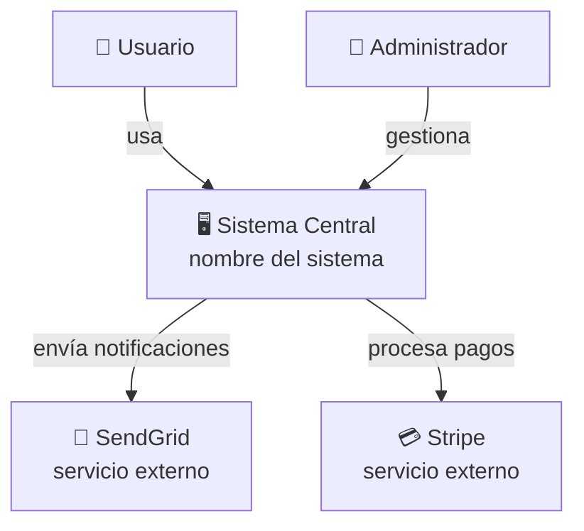
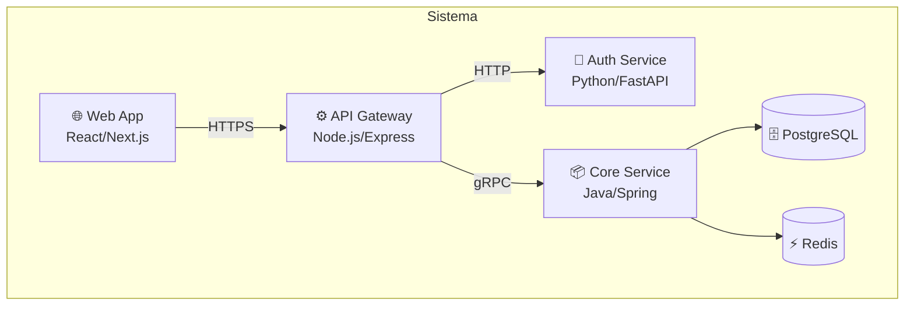
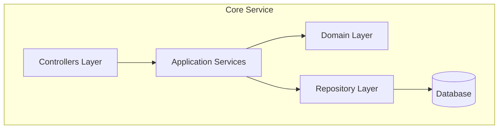

# Documentación Arquitectónica — Plantillas y Guías

## Architecture Decision Records (ADR)

Los ADRs documentan decisiones arquitectónicas importantes con su contexto y consecuencias.
Son la memoria del equipo. Se escriben en el momento de la decisión, no después.

### Cuándo escribir un ADR:
- Cuando la decisión es difícil de revertir
- Cuando afecta a múltiples equipos o sistemas
- Cuando introduce un nuevo patrón o tecnología
- Cuando va en contra de la convención establecida

### Plantilla ADR (formato MADR — Markdown Architectural Decision Records)

```markdown
# ADR-[número]: [Título corto de la decisión]

**Estado**: [Propuesto | Aceptado | Rechazado | Deprecado | Reemplazado por ADR-XXX]
**Fecha**: [YYYY-MM-DD]
**Autores**: [nombres]
**Revisores**: [nombres]

## Contexto

[Describe la situación que motivó esta decisión. ¿Qué problema existe?
¿Qué restricciones hay? ¿Qué factores son importantes?]

## Decisión

[Describe la decisión tomada. Sé específico. Usa voz activa: "Usaremos X" no "X será usado".]

## Alternativas Consideradas

### Opción 1: [Nombre]
- Pros: ...
- Contras: ...

### Opción 2: [Nombre]
- Pros: ...
- Contras: ...

### Opción 3 (elegida): [Nombre]
- Pros: ...
- Contras: ...

## Consecuencias

**Positivas:**
- [Qué mejora con esta decisión]

**Negativas / Trade-offs:**
- [Qué empeora o qué deuda se acepta]

**Riesgos:**
- [Qué puede salir mal y cómo se mitiga]

## Criterios de Revisión
[¿Cuándo debería revisarse esta decisión? Ej: "Si el volumen supera 10M usuarios"]

## Referencias
- [Links a documentación relevante, benchmarks, discusiones]
```

---

## RFC (Request for Comments)

Los RFCs son para decisiones más grandes que necesitan consenso del equipo antes de implementarse.
Son más largos que un ADR y están orientados a recibir retroalimentación.

### Plantilla RFC

```markdown
# RFC-[número]: [Título]

**Autor(es)**: [nombres]
**Fecha de propuesta**: [YYYY-MM-DD]
**Fecha límite de feedback**: [YYYY-MM-DD]
**Estado**: [Borrador | En Revisión | Aceptado | Rechazado]

## Resumen (TL;DR)
[1-3 oraciones que describen la propuesta]

## Motivación
[¿Por qué necesitamos esto? ¿Qué problema resuelve?
¿Cuál es el impacto de NO hacer esto?]

## Diseño Detallado

### Arquitectura Propuesta
[Diagramas, flujos, componentes]

### Cambios a Sistemas Existentes
[Qué cambia y cómo]

### API / Interfaz (si aplica)
[Contratos, esquemas, ejemplos]

### Plan de Migración
[Cómo se transiciona del estado actual al futuro]

## Impacto

| Área | Impacto |
|------|---------|
| Performance | [evaluación] |
| Seguridad | [evaluación] |
| Mantenibilidad | [evaluación] |
| Operaciones | [evaluación] |
| Costo | [evaluación] |

## Alternativas Rechazadas
[¿Qué más se consideró y por qué no se eligió?]

## Preguntas Abiertas
[Aspectos aún no resueltos o en debate]

## Referencias
[Links relevantes]
```

---

## Diagramas C4 en Mermaid

### Nivel 1 — Diagrama de Contexto


### Nivel 2 — Diagrama de Contenedores


### Nivel 3 — Diagrama de Componentes


---

## Runbook de Arquitectura

Template para documentar un sistema para operaciones:

```markdown
# Runbook: [Nombre del Sistema]

## Descripción
[Qué hace, quiénes son los usuarios, importancia para el negocio]

## Arquitectura General
[Diagrama o descripción de componentes principales]

## SLAs
- Disponibilidad target: 99.9%
- Latencia máxima (p99): 500ms
- RTO (Recovery Time Objective): 1 hora
- RPO (Recovery Point Objective): 5 minutos

## Dependencias
| Sistema | Tipo | Criticidad | Fallback |
|---------|------|-----------|---------|
| [Nombre] | [Externo/Interno] | [Alta/Media/Baja] | [Descripción] |

## Procedimientos Operativos

### Deploy
[Pasos para deploy, rollback, y verificación]

### Escalado
[Cómo escalar, cuándo hacerlo, límites conocidos]

### Incidentes Comunes
| Síntoma | Causa probable | Acción |
|---------|---------------|--------|

## Contactos
- On-call: [nombre / canal]
- Escalación: [nombre / canal]
- Documentación: [links]
```

---

## Buenas Prácticas de Documentación

1. **Documenta decisiones, no solo código**: El "por qué" es más valioso que el "qué"
2. **Mantén la documentación cerca del código**: ADRs en el repositorio, no en Confluence
3. **Diagrama actual, no futuro**: Documenta cómo está hoy, usa un sufijo "-proposed" para lo planeado
4. **Menos es más**: Un ADR de una página leído es mejor que un documento de 20 páginas ignorado
5. **Fecha todo**: La arquitectura envejece. La fecha es contexto crítico
6. **Revisa periódicamente**: Archiva o actualiza documentación obsoleta — la documentación incorrecta
   es peor que no tener documentación
